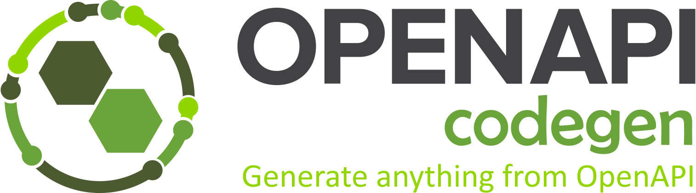

<div align="center" style="margin-bottom: 16px">
  
</div>

[](https://www.npmjs.com/package/@openapi-codegen/cli)
[](https://github.com/fabien0102/openapi-codegen/blob/main/LICENSE)

Tooling to give you full type-safety around OpenAPI specs.

**For frontend:**

This will give you full auto-completion and type-safety of your APIs

**For backend: (in coming)**

This will generate everything you need to deliver a perfect API, spec driven.

## Getting started

```bash
$ npm i -D @openapi-codegen/{cli,typescript}
$ npx openapi-codegen init
```

Follow the steps, this will generate a configuration file for you (openapi-codegen.config.ts).

You should have a bunch of types / components ready to be used.

Note: The generated `{namespace}Fetcher.ts` assume a global `fetch`, if you want to use this in a nodejs environment, please update this file (this is just a template)

## Philosophy

In software development, communication between components and documentation around it is often no fun.

GraphQL did resolve this by making documentation a part of the tooling (introspection), sadly this is often harder with REST APIs. OpenAPI can be an amazing tool, if, and only if the documentation (spec) and the actual implementation are aligned!

### Backend side

There are two different approaches:

1. The OpenAPI spec is generated from the code (**code first**)
2. The code is generated from the OpenAPI spec (**spec first**)

In either case, there needs to be an integration with the type system of the language, so everything is connected, and as we remove or update something that impacts the final response, this is **automatically** reflected!

This library has chosen the second approach, **spec first**. By doing so, your documentation is not your final (boring) task on the list, but the first and exciting one when adding new functionality! Indeed, you can’t start coding without generating your types (models & controllers) from the specs.

This has multiple benefits:

- You can take your time to think about your API before writing any code!
- You can discuss the API with your team (and discover API design problems earlier)
- You can generate all your validation rules

For example, if you add this object to your schema:

```yaml
SignUpInput:
  type: object
  properties:
    email:
      type: string
      format: email
      maxLength: 255
    password:
      type: string
      maxLength: 255
    firstName:
      type: string
      pattern: ^[0-9a-zA-Z]*$
      maxLength: 255
    lastName:
      type: string
      pattern: ^[0-9a-zA-Z]*$
      maxLength: 255
  required:
    - email
    - password
    - firstName
    - lastName
```

OpenAPI Codegen will be able to generate all the relevant validation (or at least give you the choice to do it).

Note: You can also attach any custom logic by using the `x-*` tag, the possibilities are endless!

### Frontend side

Having to reverse engineer a backend response is the least productive/fun task ever! However, given a nice OpenAPI specs, we can actually generate nicely typed code for you that lets you interact with your API in a safe manner.

Taking React as example, calling an API can be as simple as this:

```tsx
import { useListPets } from "./petStore/petStoreComponents"; // <- output from openapi-codegen

const App = () => {
  const { data, loading, error } = useListPets();

  // `data` is fully typed and have all documentation from OpenAPI
};
```

And since this generated from the specs, everything is safe at build time!

Note: If you can’t trust your backend, some runtime validation can be useful to avoid surprises in production 😅

## Configuration

The only thing you need to manage is the configuration.
Everything is typed and self-documented, but just in case, you can find here example configuration below:


### Example Config
```ts
// openapi-codegen.config.ts
import { defineConfig } from "@openapi-codegen/cli";
import {
  generateSchemaTypes,
  generateReactQueryComponents,
  /* generateExpressControllers, */
  /* generateRestfulReactComponents, */
  /* ... */
} from "@openapi-codegen/typescript";

export default defineConfig({
  example: {
    // can be overridden from cli
    from: {
      source: "github",
      owner: "fabien0102",
      repository: "openapi-codegen",
      ref: "main",
      specPath: "examples/spec.yaml",
    },

    // can be overridden from cli
    outputDir: "src/queries",

    to: async (context) => {
      // You can transform the `context.openAPIDocument` here, can be useful to remove internal routes or fixing some known issues in the specs ;)

      // Generate all the schemas types (components & responses)
      const { schemasFiles } = await generateSchemaTypes(context, {
        /* config */
      });

      // Generate all react-query components
      await generateReactQueryComponents(context, {
        /* config*/
        schemasFiles,
      });
    },
  },
});
```

### Plugins
the `@openapi-codegen/cli` supports these generator plugins:
#### **generateSchemaTypes** (frontend/backend)
  generate all schema types for your specification:
  ```ts
   const { schemasFiles } = await generateSchemaTypes(context, {
        /* config */
      });
  ```
output: `{namespace}Schemas.ts`

#### **generateFetchers** (frontend)
  generate all fetchers with types for your specification *needs schemafiles*
  ```ts
     await generateFetchers(context, {
        /* config */
        schemasFiles,
      });
  ```
output: `{namespace}Fetchers.ts`

#### **generateReactQueryComponents** (frontend)
  generate all React Query Components for useQuery() and useMutation()
  ```ts
      await generateReactQueryComponents(context, {
        /* config*/
        schemasFiles,
      });
  ```
  output: `{namespace}Components.ts`
#### **generateReactQueryFunctions** (frontend)
  generate all React Query Functions used for e.g. React-Router 6.6.0+ loader functions
  ```ts
     await generateReactQueryFunctions(context, {
        filenamePrefix,
        schemasFiles,
      });
  ```
  output: `{namespace}Functions.ts`

  example usage in react-route-loader:
  ```ts
  export const routeLoader = (queryClient: QueryClient) =>
    async ({ params }: MyParams) => 
      await queryClient.fetchQuery(...getYourQueryNameQuery({}), {
        /*options*/
      })
  ```
  *more infos: https://reactrouter.com/en/main/guides/data-libs*


You can import any generator into the `to` section, those can be the ones provided by this project or your own custom ones. You have full control of what you are generating!

Have fun!

## Contributors ✨

Thanks goes to these wonderful people ([emoji key](https://allcontributors.org/docs/en/emoji-key)):

<!-- ALL-CONTRIBUTORS-LIST:START - Do not remove or modify this section -->
<!-- prettier-ignore-start -->
<!-- markdownlint-disable -->
<table>
  <tr>
    <td align="center"><a href="https://fabien0102.com/"><br /><sub><b>Fabien BERNARD</b></sub></a><br /><a href="https://github.com/fabien0102/openapi-codegen/commits?author=fabien0102" title="Code">💻</a> <a href="#design-fabien0102" title="Design">🎨</a> <a href="https://github.com/fabien0102/openapi-codegen/commits?author=fabien0102" title="Documentation">📖</a> <a href="#ideas-fabien0102" title="Ideas, Planning, & Feedback">🤔</a> <a href="#projectManagement-fabien0102" title="Project Management">📆</a> <a href="https://github.com/fabien0102/openapi-codegen/pulls?q=is%3Apr+reviewed-by%3Afabien0102" title="Reviewed Pull Requests">👀</a></td>
    <td align="center"><a href="https://github.com/mpotomin"><br /><sub><b>mpotomin</b></sub></a><br /><a href="https://github.com/fabien0102/openapi-codegen/commits?author=mpotomin" title="Code">💻</a> <a href="#ideas-mpotomin" title="Ideas, Planning, & Feedback">🤔</a> <a href="https://github.com/fabien0102/openapi-codegen/pulls?q=is%3Apr+reviewed-by%3Ampotomin" title="Reviewed Pull Requests">👀</a></td>
    <td align="center"><a href="https://github.com/micha-f"><br /><sub><b>Michael Franzkowiak</b></sub></a><br /><a href="https://github.com/fabien0102/openapi-codegen/commits?author=micha-f" title="Documentation">📖</a></td>
    <td align="center"><a href="https://github.com/SferaDev"><br /><sub><b>Alexis Rico</b></sub></a><br /><a href="https://github.com/fabien0102/openapi-codegen/commits?author=SferaDev" title="Code">💻</a> <a href="#ideas-SferaDev" title="Ideas, Planning, & Feedback">🤔</a></td>
    <td align="center"><a href="https://ned.im/"><br /><sub><b>Nedim Arabacı</b></sub></a><br /><a href="#question-needim" title="Answering Questions">💬</a> <a href="https://github.com/fabien0102/openapi-codegen/commits?author=needim" title="Code">💻</a> <a href="#ideas-needim" title="Ideas, Planning, & Feedback">🤔</a></td>
    <td align="center"><a href="https://github.com/antoniel"><br /><sub><b>Antoniel Magalhães</b></sub></a><br /><a href="#example-antoniel" title="Examples">💡</a></td>
    <td align="center"><a href="https://github.com/DreierF"><br /><sub><b>Florian Dreier</b></sub></a><br /><a href="https://github.com/fabien0102/openapi-codegen/commits?author=DreierF" title="Code">💻</a></td>
  </tr>
  <tr>
    <td align="center"><a href="http://fabianalthaus.de"><br /><sub><b>Fabian Althaus</b></sub></a><br /><a href="https://github.com/fabien0102/openapi-codegen/commits?author=el-j" title="Code">💻</a></td>
    <td align="center"><a href="https://github.com/ci-vamp"><br /><sub><b>ci-vamp</b></sub></a><br /><a href="https://github.com/fabien0102/openapi-codegen/issues?q=author%3Aci-vamp" title="Bug reports">🐛</a> <a href="https://github.com/fabien0102/openapi-codegen/commits?author=ci-vamp" title="Code">💻</a></td>
  </tr>
</table>

<!-- markdownlint-restore -->
<!-- prettier-ignore-end -->

<!-- ALL-CONTRIBUTORS-LIST:END -->

This project follows the [all-contributors](https://github.com/all-contributors/all-contributors) specification. Contributions of any kind welcome!
